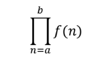

# **Standard ML: Assignment 1**

## **Problems**

### **1) Merge Lists**

Write a merge function that takes two sorted lists (in ascending order) and returns a sorted list that contains all the elements in the two lists. The signature of the
function is as following:

    merge: int list * int list -> int list

For example, merge([1,4,5], [2,6,7]) should return [1,2,4,5,6,7]. You may assume that each of the input lists does not have repeating elements. For example, [1,1,4,5] cannot be used as an input to merge function because 1 is
repeated. Also the two lists do not have common numbers. For example, we do not invoke merge([1,5], [1,7]) because 1 is in both the lists.

### **2) Reverse List**

Write a reverse function that takes a list and returns the reversed list. For example, reverse([1,5,4]) returns [4,5,1]. The signature of the function is as following:

    reverse: int list -> int list

For problem 2, you should not use the ML’s built-in function rev.

### **3) Pi Function**

Write a pi function that takes two integers, a and b, and a function f and returns the following:

The signature of pi is as following:

    pi: int * int * (int -> int) -> int

In other words, pi(a,b,f) computes f(a) × f(a + 1) × ... × f(b − 1) × f(b)

### **4) Digits Function**

Write digits function that takes a positive integer and returns the list of digits of the integer. For example, digits(253) returns [2,5,3] . The function’s signature should be:

    digits: int -> int list

You may assume that the input is a positive number.

### **5) Digital Roots and Additive Persistence**

Consider the process of taking a number, adding its digits, then adding the digits of the number derived from it, etc., until the remaining number has only one digit.

The number of additions required to obtain a single digit from a number n is called the additive persistence of n, and the digit obtained is called the digital root of n. For example, the sequence obtained from the starting number 9876 is (9876, 30, 3), so 9876 has an additive persistence of 2 and a digital root of 3. For the starting number
12349, the process produces (12349, 19, 10, 1), so 12349 has an additive persistence of 3 and a digital root of 1. Write two functions additivePersistence and digitalRoot that take positive integer argument n and return the additive persistence and the digital root of n respectively. The signatures of the functions are as following:

    additivePersistence: int -> int
    digitalRoot: int -> int

You can use digits function defined in the previous question.