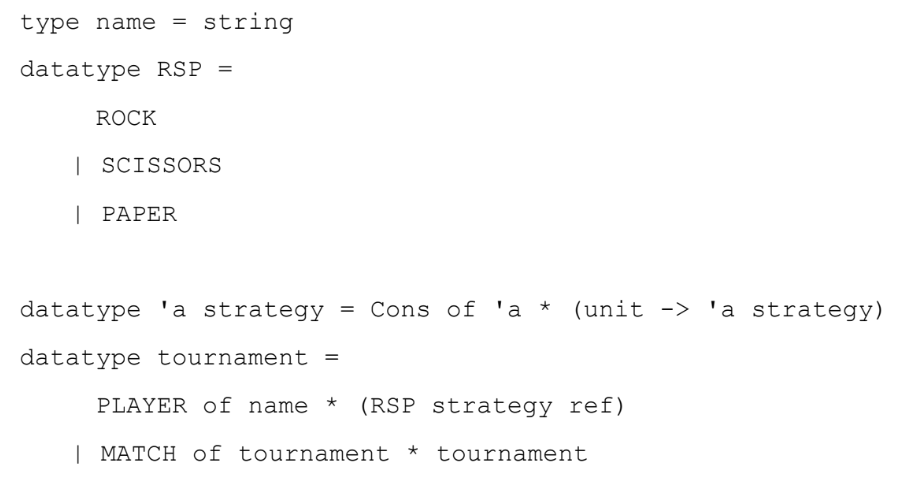
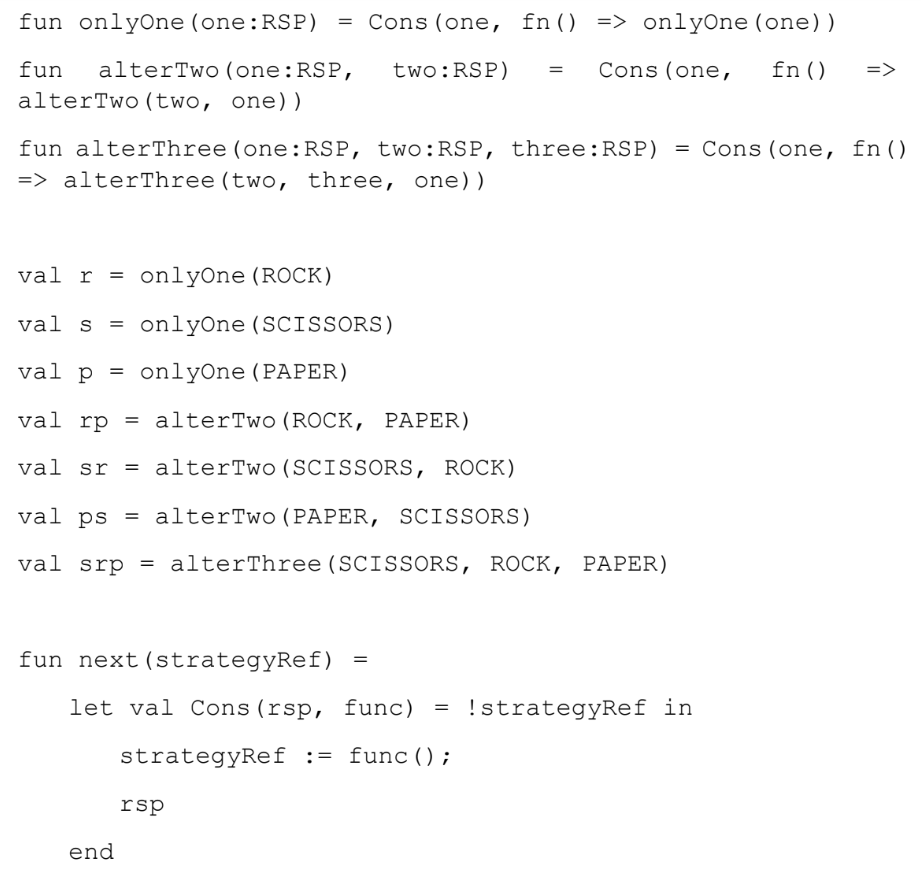

# **Standard ML: Assignment 3**

## **Problems**

Problems 1 and 2 use the following type definitions, which are similar to the pattern
matching in ML:

    datatype pattern = Wildcard | Variable of string | UnitP
    | ConstP of int | TupleP of pattern list
    | ConstructorP of string * pattern

    datatype valu = Const of int | Unit | Tuple of valu list
    | Constructor of string * valu

Given valu v and pattern p, either p matches v or not. If it does, the match produces a list of string * valu pairs; order in the list does not matter. The rules for matching should be unsurprising:
- Wildcard matches everything and produces the empty list of bindings.
- Variable s matches any value v and produces the one-element list holding
(s,v).
- UnitP matches only Unit and produces the empty list of bindings.
- ConstP 17 matches only Const 17 and produces the empty list of bindings
(and similarly for other integers).
- TupleP ps matches a value of the form Tuple vs if ps and vs have the same
length and for all i, the i-th element of ps matches the i-th element of vs. The list
of bindings produced is all the lists from the nested pattern matches appended together.
- ConstructorP(s1,p) matches Constructor(s2,v) if s1 and s2 are the same string (you can compare them with =) and p matches v. The list of bindings produced is the list from the nested pattern match. We call the strings s1 and s2 the constructor name.
- Nothing else matches.

 

1. `check_pat` 
    - Write a function `check_pat` that takes a pattern and returns true if and only if all the variables appearing in the pattern are distinct from each other (i.e., use different strings). The constructor names are not relevant. Hints: The sample solution uses two helper functions. The first takes a pattern and returns a list of all the strings it uses for variables. Using foldl with a function that uses append is useful in one case. The second takes a list of strings and decides if it has repeats. List.exists may be useful. You don’t have to use foldl and List.exists, but those functions make it easier.   
    `val check_pat = fn : pattern -> bool`

 

2. `match`
    - Write a function `match` that takes a `valu * pattern` and returns a `(string * valu)` list option, namely NONE if the pattern does not match and SOME lst where lst is the list of bindings if it does match; `string * valu` tuple represents the variable name (string) for the value (valu). Note that if the value matches but the pattern has no patterns of the form Variable s, then the result is SOME []. 
    - Hints: Sample solution has one case expression with 7 branches. The branch for tuples uses `List.filter` (to get the list of elements satisfying a condition) and `ListPair.zip`. You don’t have to use `List.filter` and `ListPair.zip` here, but they make it easier.  
    `val match = fn : valu * pattern -> (string * valu) list option`

 

### **Problem 3**
You will implement the tournament of Rock, Paper, Scissors game. The followings are the data types we define to implement the tournament:

RSP strategy is a stream of RSP, which, when called, gives a pair of RSP and a function
closure that will give the next item in the stream. The following variables (r, s, p, rp, etc) are example RSP strategies, and the function next retrieves one RSP value from the given RSP strategy.

In this question, you are asked to implement whosWinner function, which takes a
tournament as its parameter and returns the winner of the tournament. For example, for
the following code,

    val winner = whosWinner(MATCH(PLAYER("s", ref s),
    MATCH(PLAYER("rp", ref rp), PLAYER("r", ref r))));

whosWinner returns a player who won the tournament, that is, PLAYER(“rp”, ref rp) above.
Use pattern matching (case expressions) to implement whosWinner function.
