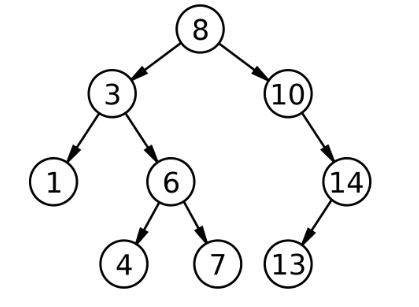

# **Racket: Assignment 4**

## **Problems**

### 1) `check_bst `

Binary search tree (BST) is a data structure that stores values in a tree structure. In BST,
all the values stored on the left branch are smaller than the value in the current node, and all the values stored on the right branch are larger than the value in the current node. For example, the following diagram shows a binary search tree where the root node stores the value 8, and its left branch stores values that are smaller than 8 (maximum 7) and the right branch stores values that are larger than 8 (minimum 10).

In Racket, a BST can be represented in a list. A BST node is represented as a Racket
list having three elements; the first element is the value in the node, and the second
element is the left branch and the third element is the right branch. For example, ' (6 (4 () ()) (7 () ())) is a BST where the root node stores 6, its left child (a leaf node) stores 4, and its right child (also a leaf node) stores 7. The above tree is represented in the following list: ' (8 (3 (1 () ()) (6 (4 () ()) (7 () ()))) (10 () (14 (13 () ()) ())))

Write a function `check_bst` that takes a tree node represented in the above list form, and returns a boolean value; it returns true if the given tree node is a proper BST node, and false otherwise. For example, `(check_bst '(6 (4 ()()) (7 ()())))` returns #t because the argument is a proper BST node; however, `(check_bst '(6 (7 ()()) (8 ()())))` returns #f because it does not satisfy the BST constraint
that the values in the left child are smaller than the current value. You can assume that the list is in a proper form – for example, all the lists and nested lists have three elements (or null).

### 2) `apply`

For the BST described in the previous problem, write a function `apply` that takes a function f and a BST, and applies the function to each value in the tree node; `apply` returns a new binary tree where the values in each node are the return values of the function f. Note that the returned tree may not be binary search tree. For example, `(apply (lambda (v) (+ v 1)) '(7 (6 ()()) (8 ()())))returns '(8 (7 ()()) (9 ()())))` 

You can assume that for the second argument of `apply`, `check_bst` returns #t.

### 3) `equals`

For the BST described in the previous problem, write a function equals that takes two BSTs and
returns #t if the two BSTs have the same  values, and #f otherwise. For example, `(equals '(7 (6 ()()) (8 ()())) '(6 () (7 () (8 ()()))))` returns #t , but `(equals '(7 (6 ()()) (8 ()())) '(7 (6 ()()) (8 ()(9 () ()))))` returns #f. You can also assume that `check_bst` returns #t for the two inputs.